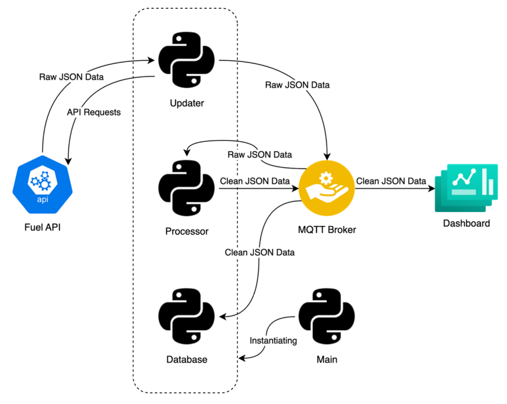
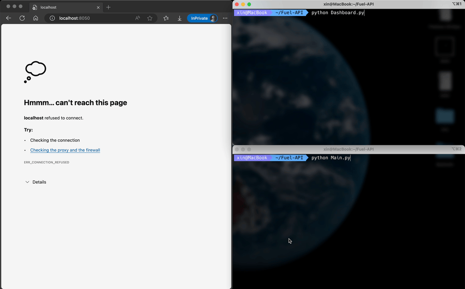

# Fuel API Data Pipeline
This is a data pipeline project that collects data from [Fuel API](https://api.nsw.gov.au/Product/Index/22) and stores them in a PostgreSQL database. The data is then visualized using [Dash](https://plotly.com/dash/) and [Plotly](https://plotly.com/).
## Structure of the Data Pipeline

## How to Run
0. Use following command in the terminal to clone the repository
    ```bash
    git clone https://github.com/V1CTORHS1N/fuel-api-data-pipeline.git
    ```
1. Get your own API key from [Fuel API](https://api.nsw.gov.au/Product/Index/22).
2. Fill `self.api_key` and `self.auth_header` with your API key and authorization header in the `Updater.py` file.
3. Set up your own PostgreSQL database and fill in the database details in the `Database.py` file. Please ensure there is no schema called `fuel` in the database before the first run.
4. [Optional] Use [Miniconda](https://docs.conda.io/projects/miniconda/en/latest/) to create and activate a virtual environment with following commands
    ```bash
    conda create --name fuel-api python=3.8
    conda activate fuel-api
    ```
5. Change directory to the project root directory and install the required packages in `requirements.txt` using

    ```bash
    pip install -r /path/to/requirements.txt
    ```
6. Run the `Dashboard.py` first with

    ```bash
    python /path/to/Dashboard.py
    ```
7. Run the `Main.py` file with

    ```bash
    python /path/to/Main.py
    ```
8. The dashboard will be available at `http://localhost:8050/` by default.
9. Enjoy your hacking!
## Demo

